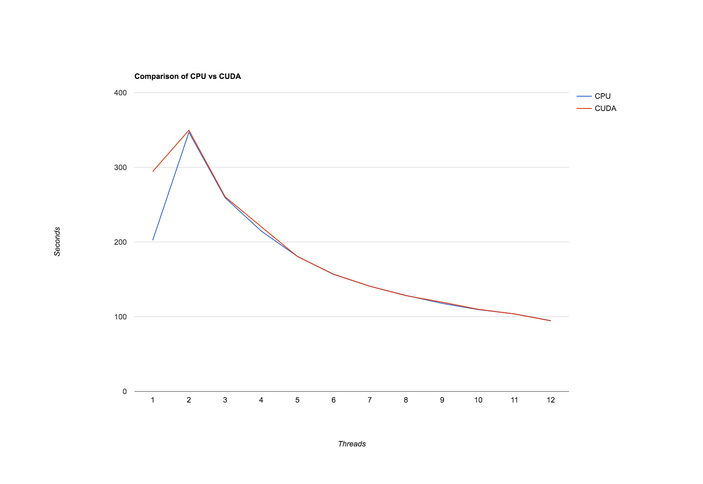

# Introduction
Inferring relations among genes requires a significant amount of data.
Bayesian networks may be used to correlate this data and extract relationships among the genes @sriram. We do not know what this relationship is, but we do know it has a high likelihood of existing.
These relationships can then be used to make testable hypotheses to determine how gene interactions influence life in organisms or humans. As a result, tests can be performed in the lab with more confidence and a reduced chance of wasting time and resources.

This concept has been applied to smaller data sets and shows promising results @sriram, however remains too slow to be applied to a larger problem.
It is our objective to decrease the runtime required to form a network which may reveal genetic interactions.
Bayesian network learning, however, is inherently slow because it is an NP-hard algorithm @cooper.
Search space reduction algorithms may be utilized to reduce the computational complexity.
K2 is a great example of a search space reduction algorithm, and is our algorithm of choice. However, it introduces a new problem. K2 restricts the parent hierarchy of genes within the network @cooper, and thus introduces bias in the computed relations.
To achieve high confidence in the generated networks, an abundance of Bayesian networks need to be computed using random search space restrictions. These random search space restrictions (or topologies) remove the bias and provide results which can be interpreted at various levels of confidence.

By eliminating one problem and introducing another, consensus networks enable the ability of parallelization by requiring multiple units of work rather than just one faster unit of work.
Other authors describe parallel implementations that can increase the speed of Bayesian network learning @altekar @misra.
However, no libraries existed which compute multiple Bayesian networks concurrently.

This paper is an extension to the initial implementation of the program, which shows why the algorithm needs to be sped up @firstpaper.
An increase in samples causes linear growth of the problem and introduction of additional genes causes exponential growth of the problem @firstpaper.

This project examines the value of Bayesian network learning within a GPGPU accelerated environment in order to reduce the time needed to generate consensus networks using many topological inputs.

# Background
## Bayesian Networks
Bayesian networks capture qualitative relationships among variables within a directed acyclic graph (or DAG).
Nodes within the DAG represent variables, and edges represent dependencies between the variables @korb @pearl.
Bayesian networks have a search space which grows exponentially when introducing new nodes and not placing restrictions on the structure of the network.
This complication can be overcome by using the K2 algorithm. The K2 algorithm reduces the computational cost of learning by imposing restraints on parent node connections via topological ordering @cooper.
Here, a topology refers to a hierarchical structure of parenthood that the K2 algorithm will utilize to reduce overall computational complexity while scoring data relationships.
Restricting the parent ordering, however, creates an issue of bias, which is inherent within a constraint-based search space reduction @sriram.
Sriram @sriram proposed a solution to this issue by creating a consensus network, or the combination of multiple Bayesian networks derived from several topological inputs.
To eliminate the bias created by these restraints, many randomly generated topologies are used. By increasing the number of topological inputs, the consensus network has a greater chance of reflecting the true nature of the gene interactions with higher levels of confidence.

## OpenMP
OpenMP or (Open Multi-Processing) is a cross-platform, multilingual application programming interface (API) which enables shared-memory parallel programming on a single machine.
The OpenMP specification consists of compiler directives and library functions used to parallelize portions of a program's control flow @openmpapi.
The most rudimentary example of OpenMP would be to distribute a for-loop across multiple threads.

An advisory board of top entities in computation controls its specification @openmpboard which can be implemented by various compilers to target specific system capabilities and architectures.
The specification includes language-specific APIs, compiler directives, and standardized environment variables @openmpapi.
The model of OpenMP is comparable to the fork-join model, but provides additional convenience (cross-platform) features through compiler directives. These directives consist of, but are not limited to, barriers, critical regions, variable atomicity, shared memory, and reductions @openmpapi.

OpenMP enables parallel code portability at a level which would not be achievable while retaining an ideal code climate.
OpenMP, by nature allows simple and straight-forward parallelization of loops with a compiler directive that targets the system for which the program is compiled on.
Without OpenMP, the program would have to include many different libraries and routines to achieve parallel code across different systems. The result of this would be a program which only works on a specific set of machines, or a code base which is hard to maintain and debug when changes are made to the underlying algorithm.

## CUDA
CUDA is a parallel computing platform and application programming interface (API) developed by NVIDIA @cudainfo.
CUDA allows software developers to utilize CUDA-enabled GPUs for general purpose processing (or GPGPU).
CUDA introduces a concept called kernels, which are extensions of C functions that, when called, are executed in parallel by CUDA threads instead of once like regular C functions @cudaguide.
The primary use case is when work is independent and many things need to be done in parallel (e.g. scaling a vector).
Due to the structure of threads on the GPU, operations such as branches or jumps are permitted but highly discouraged. This is because threads run in lockstep and when a branch happens, the branches are executed serially. This means threads are suspended and do not continue execution while the opposite branch is being explored. After the branch completes and the instructions converge, all threads resume running @cudaguide. This has many detrimental performance implications.
Knowing this, the GPU is best suited for vector-operations like scaling or other arithmetic which does not branch.
The memory for CUDA also resides on the GPU itself, which means before any kernels are executed memory must be copied to the GPU.
Memory must then also be copied back to the host machine for use by the CPU @cudaguide.
This adds a delay which may invalidate the benefits of CUDA for smaller workloads. We will evaluate this in this study.

# Methodology
Testing was performed on the `tesla` machine at the University of Akron's Computer Science Department. The machine contains a Tesla K40C and 2x Intel(R) Xeon(R) CPU X5690 @ 3.47GHz.
All tests utilize purely synthetic data in the form of a gene-by-sample matrix consisting of the presence or absence of each gene within the sample.
This data was generated according to a model we defined.
We then ensured the result of the consensus network(s) matched our model to validate functionality and evaluate a degree of correctness for our algorithm.
Each test was run five times with the mean, standard deviation, and standard error calculated to measure runtime consistency.

The library being used to run the tests is available online @sourcecode. This library was implemented as described in this paper.

## Processors
The first natural step in parallelizing computation is to attempt to use multiple cores (or threads) simultaneously on the machine. This can be done by running multiple instances of the program, or by implementing code which takes advantage of multiple threads.
There is a lot of shared memory in the program, however, which adds additional complexity and latency when running multiple instances of the program. To keep things simple and quick, a single program instance will be utilized.
Analyzing the program reveals a couple potential places for parallelization. There are many for-loops which perform actions which are independent from one another.
The for-loops identified for inspection are the generation of topologies and the iteration over the topologies to generate networks.

The generation of topologies results in a a predetermined number of topologies filled into an array. This operation can be easily parallelized across multiple cores as they are independent.
The appropriate tool to perform this parallelization is OpenMP. OpenMP was implemented with a simple compiler directive which sped up computation.
```c++
#pragma omp parallel for
for (...) { }
```

Iterating over the topologies to generate networks can also be parallelized.
The creation of Bayesian networks are independent from one another, and thus, networks can be asynchronously generated.
Implementation of this parallelization is straight-forward as Bayesian network computation does not mutate its data set. This prevents us from having to replicate the memory and increase the space complexity of the algorithm. OpenMP was implemented again as shown above.
Additionally, within the parallel for, the resulting network must be appended to the consensus network.
The consensus network, however, is not thread-safe and must be operated on within a critical section. A critical section specifies that the code can only be executed on one thread at a time.
```c++
#pragma omp critical
for (...) { }
```
This ensures the networks are properly summed together, otherwise, an addition may be lost. For example, if `Thread A` and `Thread B` attempt to increment a variable at the same time, they may both access the value before the other commits the new value. This will result in a lost operation, as the threads are not aware of one another.

To measure the resulting computational runtime decrease, multiple tests were performed with varying number of processors.
A single set of synthetic data was used which consisted of 10 genes and 102,400 samples.
Using `tesla` (2x Intel(R) Xeon(R) CPU X5690 @ 3.47GHz), tests were run by varying the number of processors (up to 12) and measuring the algorithm performance for the creation of 16 Bayesian networks per gene (160 total).
We have reached the resource limits on the system(s) which we have access to, and cannot test beyond 12 cores. The selection of 10 genes and 16 Bayesian networks was arbitrarily chosen as sufficient means to measure computation time.

## CUDA
Since network generation relies heavily on matrix math, which consists of many vector operations, it makes sense to explore acceleration using CUDA.
Parallelizing code in CUDA required a redesign on the matrix class to ensure it was stored in contiguous memory and not behind double pointers.
After this sophisticated redesign, it was relatively trivial to add CUDA to the equation in effort to reduce computation time.

At its core, the implementation depends on a hybrid switch between utilizing CUDA or not and managing the memory state. The switch evaluates the size of the matrix and evaluates whether or not the size of the computation warrants the latency of the copy from the host to the device and back.

# Results and Discussion



## Processors
When increasing the number of processors, a very strange anomaly occurs.
When first increasing the amount of work to two processors, runtime actually increases significantly.
This remains true until about 4 or 5 processors, where the runtime finally proceeds to drop below the initial runtime execution. Exact results may be seen in Table 1.

\begin{table}[ht]
\centering
\caption{Runtimes for the program across increasing numbers of processors.}
\label{procs_table}
\begin{tabular}{|l|l|l|l|}
\hline
\textbf{Cores} & \textbf{Mean Time} \\ \hline
1 & 202.377s \\ \hline
2 & 346.851s \\ \hline
3 & 259.284s \\ \hline
4 & 214.646s \\ \hline
5 & 180.662s \\ \hline
6 & 156.596s \\ \hline
7 & 140.779s \\ \hline
8 & 128.487s \\ \hline
9 & 117.792s \\ \hline
10 & 109.486s \\ \hline
11 & 103.762s \\ \hline
12 & 94.739s \\ \hline
\end{tabular}
\end{table}

The program runtime is not consistent with how OpenMP distributes its work.
OpenMP distributes the task of an independent Bayesian network computation across multiple threads simultaneously. These independent tasks are non-blocking and do not lock one another, and thus should have very little contention.
There is one lock after each computation which appends the network to the consensus network, but it has been negligible in previous experiments @firstpaper to the total time taken to compute the Bayesian networks.

It's difficult to reason about this,

# CUDA
When performing matrix operations on CUDA, the performance increase is negative.
In a couple cases, the CUDA implementation beats out the CPU by fractions of a second.
The tests were performed on a Tesla K40c card, which contains 15 multiprocessors at 192 stream processors each (2880 total stream cores), versus the system's 12 cores.

Figure 1 illustrates that when using CUDA, the runtime increase is negative. Exact results may be seen in Table 2.

\begin{table}[ht]
\centering
\caption{Runtimes for the program across increasing numbers of processors while using CUDA.}
\label{procs_table}
\begin{tabular}{|l|l|l|l|}
\hline
\textbf{Cores (+ CUDA)} & \textbf{Mean Time} \\ \hline
1 & 294.369s \\ \hline
2 & 349.657s \\ \hline
3 & 260.654s \\ \hline
4 & 220.396s \\ \hline
5 & 180.566s \\ \hline
6 & 156.880s \\ \hline
7 & 140.821s \\ \hline
8 & 128.177s \\ \hline
9 & 119.473s \\ \hline
10 & 109.909s \\ \hline
11 & 103.632s \\ \hline
12 & 94.461s \\ \hline
\end{tabular}
\end{table}

The detrimental performance (and seldom marginal increase) is unfortunate, but understandable. Essentially, the time it takes to copy memory to and from the GPU outweighs that of the performance gain of `O(n)` operations, as computing networks does not perform any matrix multiplication (approx `O(n^3)`) and strictly `O(n)` operations (e.g. addition, subtraction, scalars).

# Conclusion
By generating a consensus network out of many Bayesian networks, researchers may screen and infer new gene interactions. This allows researchers to feel more confident about testing hypotheses in the lab, such that their resources and time will not be wasted.

We have concluded that utilizing parallelization through means of CUDA trivially reduces the time to generate a consensus network.
Future work may involve parallelizing the coalescing of consensus networks in effort to reduce the overhead introduced when increasing cluster parallelism.

# Acknowledgments
This research was funded in part by a grant from the Choose Ohio First Bioinformatics scholarship.
Additional resources were provided by the The University of Akron's Buchtel College of Arts and Sciences.

The data, statements, and views within this paper are solely the responsibility of the authors.

\section{References}
